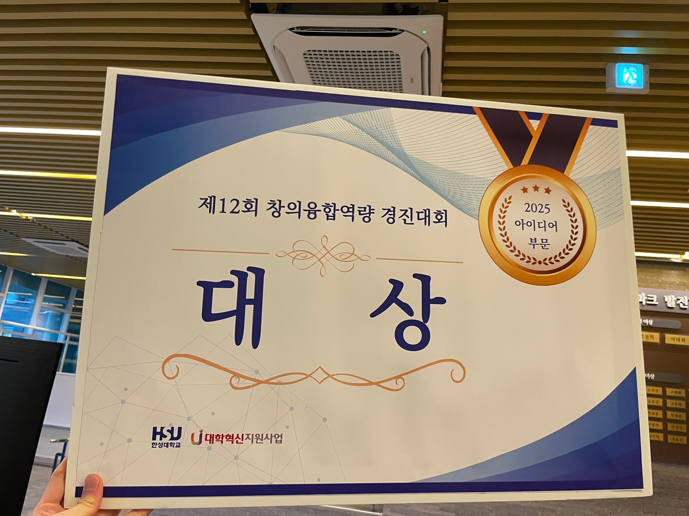

# MEDISON (메디슨)

## 🚀 프로젝트명: 생체 인식 기반 미래형 AI - 블록체인 응급환자 골든 타임 확보 시스템 프로토타입

### ✨ 소개

이 GitHub 프로젝트는 **MEDISON (메디슨) 팀**이 개발하는 **'생체 인식 기반 미래형 AI - 블록체인 응급환자 골든 타임 확보 시스템'**의 리액트 네이티브(React Native) 기반 **프로토타입** 애플리케이션입니다.

본 프로토타입은 응급 상황 발생 시 환자의 생체 정보를 신속하게 인식하고, 이를 AI 및 블록체인 기술과 연계하여 환자의 '골든 타임'을 확보하는 시스템의 핵심 아이디어를 시각적으로 구현하고 검증하기 위해 제작되었습니다.

### 🌟 주요 특징 (프로토타입 기능)

현재 이 프로토타입은 기본적인 화면 전환 기능을 중심으로 개발되었으며, 다음과 같은 핵심적인 화면 흐름을 포함하고 있습니다:

* **로그인 화면:** 앱 시작 시 사용자에게 가장 먼저 노출되는 초기 화면입니다. (실제 인증 로직은 포함되어 있지 않습니다.)
* **메인 화면:** 로그인 버튼 클릭 시 이동하는 앱의 주요 기능이 구현될 공간입니다.

> **참고:** 본 프로젝트는 아이디어의 실현 가능성을 보여주는 **개념 증명(Proof of Concept)** 단계의 프로토타입이므로, 실제 블록체인 연동, AI 처리, 생체 인식 기능, 백엔드 통신 등은 포함하고 있지 않습니다. 이러한 기능들은 향후 개발 단계에서 점진적으로 구현될 예정입니다.

### 🛠️ 기술 스택

* **프레임워크:** React Native (자바스크립트)
* **패키지 매니저:** npm 또는 Yarn

### 🚀 프로젝트 시작하기

#### 1. 필수 요구사항 설치

* Node.js (LTS 버전 권장)
* npm (Node.js 설치 시 함께 설치) 또는 Yarn
* Expo CLI (가장 빠르고 쉽게 시작할 수 있습니다)
    ```bash
    npm install -g expo-cli
    ```

#### 2. 프로젝트 클론

git clone [이 레포지토리의 URL]
cd [클론된 폴더명, 예: MyAwesomeApp]

#### 3. 종속성 설치
npm install # 또는 yarn install

#### 4. 개발 서버 실행
npm start # 또는 expo start

명령어를 실행하면 QR 코드가 터미널에 나타납니다. 스마트폰에 Expo Go 앱을 설치하고 해당 QR 코드를 스캔하면 앱을 바로 테스트할 수 있습니다.

### 📄 라이선스

이 프로젝트는 [여기에 라이선스 명시, 예: MIT License]에 따라 라이선스가 부여됩니다.

---

## 💡 아이디어 소개

본 프로젝트는 [한성대학교 창의융합역량 경진대회 아이디어 부문](https://hansung.ac.kr/cncschool/7726/subview.do?enc=Zm5jdDF8QEB8JTJGYmJzJTJGY25jc2Nob29sJTJGODE2JTJGMjY4NDY3JTJGYXJ0Y2xWaWV3LmRvJTNG)으로 출전하였습니다.

### 아이디어 판넬

| 아이디어 판넬 |
|:---:|
|  |

> 이미지는 `images` 폴더에 `idea_panel.png` 파일을 넣어주세요.

### 아이디어 소개 영상

> 아이디어 소개 영상은 아래 링크에 업로드해 주세요.
> [아이디어 소개 영상 링크](여기에_영상_URL을_입력하세요)

---

## 🏆 수상 내역

본 프로젝트는 **한성대학교 제12회 창의융합역량 경진대회(2025-1학기) 아이디어 부문 대상**을 수상하였습니다.

- **대회명:** 제12회 창의융합역량 경진대회
- **주최:** 한성대학교 창의융합교육지원센터
- **수상 부문:** 아이디어
- **수상 등급:** 대상
- **수상 일자:** 2025년 5월

### 🖼️ 수상 관련 이미지

| 대상 판넬 | 대상 상장 |
|:---:|:---:|
|  |  |

> 이미지는 `images` 폴더에 `panel_award.png`, `certificate_award.png` 파일을 넣어주세요.

---